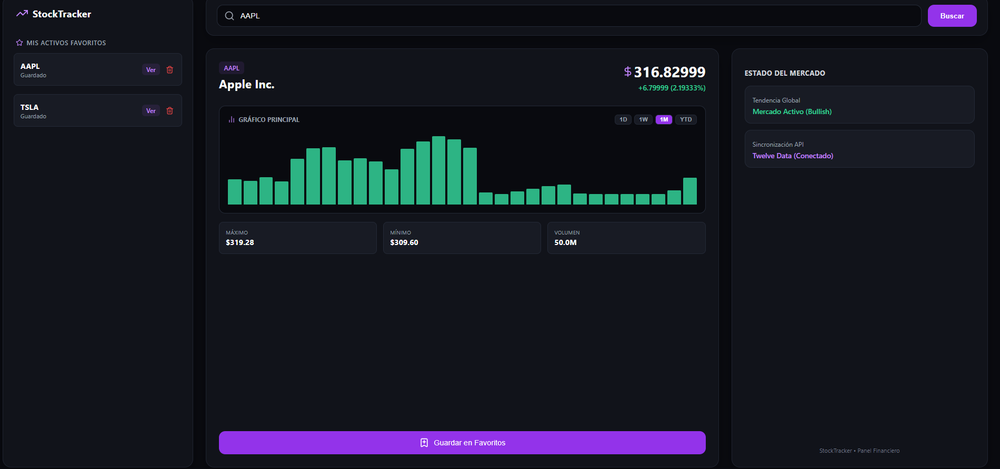

# 📈 Stock Tracker | Aplicación Web de Seguimiento Financiero

**Stock Tracker** Aplicación web moderna y dinámica diseñada para consultar cotizaciones y datos financieros del mercado de valores en tiempo real. La app conecta una interfaz rápida con APIs financieras y Supabase para ofrecer una buena experiencia.

## 🌐 Demo

* **Sitio Web:** [https://stock-tracke-app.netlify.app/](https://stock-tracke-app.netlify.app/)



## 🎯 Sobre el Proyecto

Desarrollé este proyecto con el objetivo de crear una herramienta eficiente para la consulta rápida de datos. 

## ✨ Qué puede hacer la aplicación

* **Búsqueda de activos en tiempo real:** Consulta cotizaciones actualizadas al instante mediante.
* **Métricas financieras detalladas:** Visualización de precios, cambios, porcentajes, máximos, mínimos y volúmenes de negociación.
* **Gestión de datos con Supabase:** Estructuración y soporte de base de datos para almacenar configuraciones o información relevante del sistema.
* **Diseño adaptativo (Responsive):** Interfaz moderna, limpia y optimizada tanto para dispositivos móviles como para ordenadores.

## 🛠️ Tecnologías Utilizadas

* **Frontend:** React + TypeScript
* **Empaquetador:** Vite
* **Estilos:** Tailwind CSS
* **Base de Datos y Backend:** Supabase
* **Datos Financieros:** Twelve Data API
* **Hosting y Despliegue:** Netlify
* **Control de Versiones:** Git & GitHub

## 💻 Instalación y Uso Local

Si quieres clonar y probar el proyecto en tu máquina local, sigue estos pasos:

1. **Clona el repositorio:**
   ```bash
   git clone [https://github.com/TU_USUARIO/stock-tracker.git](https://github.com/TU_USUARIO/stock-tracker.git)
   cd stock-tracker